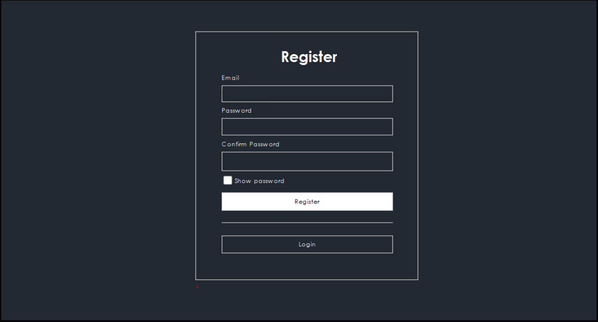
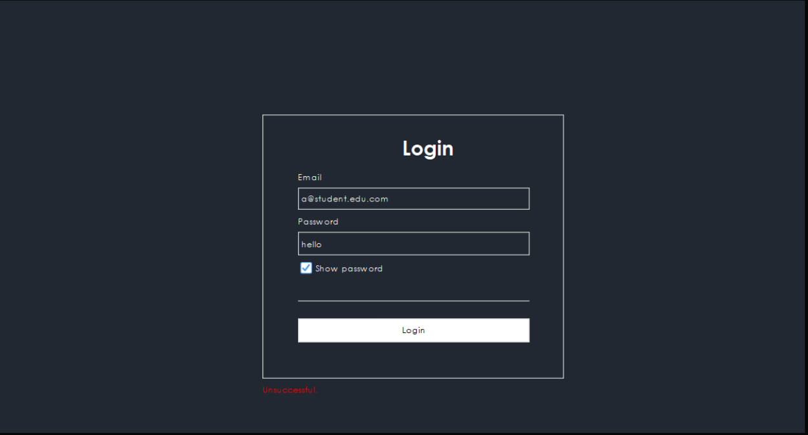
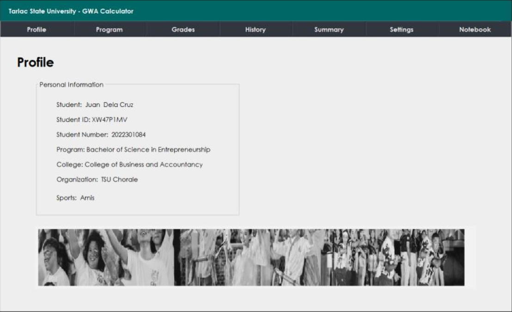
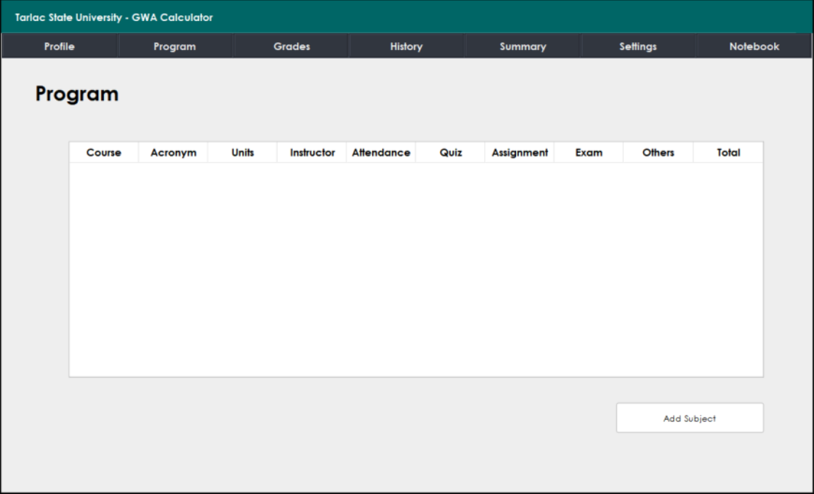
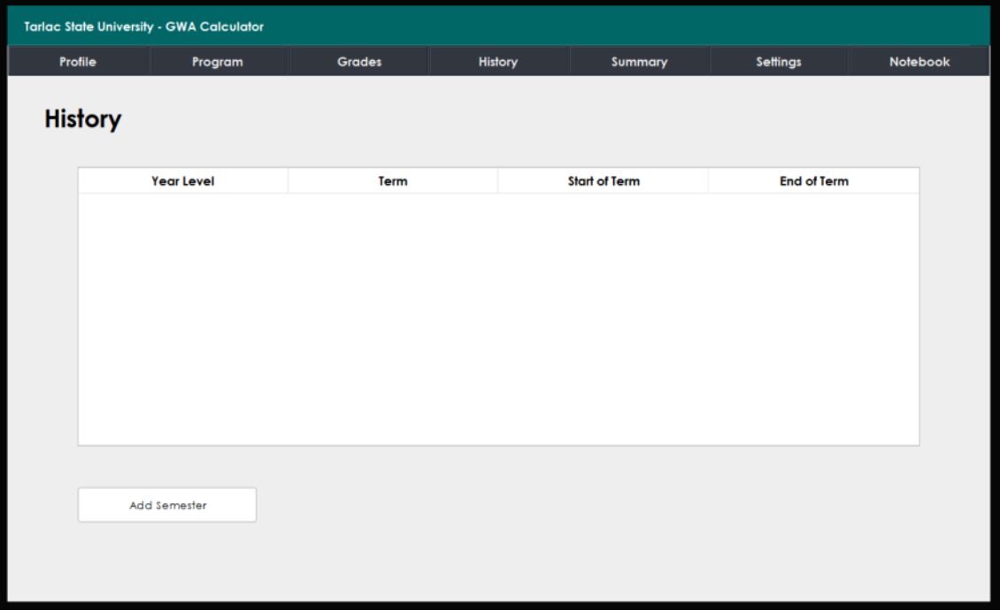

# College GWA Calculator


College GWA Calculator is a Java desktop application for tracking student academic information and calculating a college General Weighted Average (GWA). It combines a Swing dashboard, Excel-based student records, subject management, semester history, and grade evaluation tools in one local application.

## Table of Contents

- [Preview](#preview)
- [Tech Stack](#tech-stack)
- [Repository Overview](#repository-overview)
- [Features](#features)
- [Academic Calculation Model](#academic-calculation-model)
- [Installation Guide](#installation-guide)
- [Usage](#usage)
- [Constraints and Future Improvements](#constraints-and-future-improvements)
- [License](#license)

## Preview

| Screen | Preview | Description |
| --- | --- | --- |
| Registration |  | Account creation screen with email, password, confirm password, and show-password controls. |
| Student Details |  | Follow-up registration form for collecting student identity, academic program, organization, and sports details. |
| Login |  | Authentication screen for returning users, including inline login feedback. |
| Profile |  | Student profile panel showing personal, program, college, organization, and sports information. |
| Program |  | Program panel for viewing subject records and grading criteria columns. |
| Add Subject |  | Subject entry dialog for course metadata, unit count, instructor, and grading percentages. |
| Grades |  | GWA calculation panel with course grades, units, strongest subject, weakest subject, letter grade, and quality remark. |
| History |  | Semester history panel for tracking year level, term, and term dates. |
| Add Semester |  | Semester entry dialog for adding academic history records. |

## Tech Stack

| Category | Technology | Purpose |
| --- | --- | --- |
| Programming language | Java 14 | Core application logic and desktop UI implementation. |
| Desktop UI | Java Swing | Builds the login flow, dashboard, tables, forms, dialogs, and panel navigation. |
| UI look and feel | FlatLaf 3.0 | Applies a modern light theme to the Swing interface. |
| Build tool | Apache Maven | Manages dependencies, compilation, and project packaging. |
| Data storage | Microsoft Excel workbook (`.xlsx`) | Stores user credentials and student profile records locally. |
| Excel integration | Apache POI 5.2.3 / POI OOXML 5.2.3 | Reads from and writes to Excel workbooks. |
| GUI builder support | NetBeans form files / AbsoluteLayout | Preserves NetBeans-generated Swing layouts and form metadata. |
| Version control | Git | Tracks source changes and project history. |

## Repository Overview

```text
.
|-- pom.xml
|-- nbactions.xml
|-- README.md
`-- src/main/java
    |-- cgwac
    |   |-- main
    |   |   |-- LoginOrSignUp.java
    |   |   |-- Main.java
    |   |   |-- Register.java
    |   |   |-- RegisterForm.java
    |   |   |-- SignUp.java
    |   |   `-- LogIn.java
    |   |-- panels
    |   |   |-- ProfilePanel.java
    |   |   |-- ProgramPanel.java
    |   |   |-- GradesPanel.java
    |   |   |-- HistoryPanel.java
    |   |   |-- SummaryPanel.java
    |   |   |-- SettingsPanel.java
    |   |   `-- NotebookPanel.java
    |   |-- encapsulation
    |   |   |-- Student.java
    |   |   |-- Subjects.java
    |   |   |-- Semester.java
    |   |   |-- AddSubject.java
    |   |   `-- AddSemester.java
    |   |-- readandwrite
    |   |   |-- ReadStudent.java
    |   |   `-- WriteStudent.java
    |   `-- universal
    |       |-- BackgroundTask.java
    |       |-- CenteredTableCellRenderer.java
    |       `-- Must.java
    `-- com/mycompany/collegegwacalculator
        |-- GWACalculator.java
        `-- GradesCalculator.java
```

The main application lives under the `cgwac` package. The `main` package handles authentication and frame-level navigation, `panels` contains the dashboard screens, `encapsulation` stores student, subject, and semester models, and `readandwrite` manages Excel persistence through Apache POI.

## Features

- Register and log in with a student email account.
- Store student credentials and profile data in a local Excel workbook.
- Display student profile details such as student number, program, college, organization, and sports.
- Navigate between Profile, Program, Grades, History, Summary, Settings, and Notebook dashboard panels.
- Add subjects with course name, acronym, units, instructor, and grading criteria.
- Calculate GWA from entered grades and course units.
- Convert computed GWA into letter-grade and quality remarks.
- Identify strongest and weakest subjects from entered grade data.
- Add semester history entries with year level, term, start date, and end date.
- Use centered table rendering and a consistent FlatLaf-based desktop interface.

## Academic Calculation Model

The GWA calculator uses the weighted-average formula:

```text
GWA = sum(grade * units) / sum(units)
```

The result is formatted to two decimal places and mapped to a letter grade and quality remark. For example, values from `1.00` to `1.24` are categorized as `A+` / `Excellent`, while values of `5.00` and above are categorized as `F` / `Failing`.

## Installation Guide

### Prerequisites

- Java Development Kit 14 or later
- Apache Maven
- NetBeans, recommended if editing the `.form` GUI builder files
- A local `.xlsx` workbook for student data

### Setup

1. Clone the repository:

   ```bash
   git clone <repository-url>
   cd collegegwacalculator
   ```

2. Install dependencies and compile the project:

   ```bash
   mvn clean compile
   ```

3. Create or provide the expected Excel workbook before using registration and login features.

   The current source uses hard-coded Windows paths such as:

   ```text
   C:\Programs\JavaProjects\NetbeansProjects\student_data.xlsx
   C:\JavaProjects\NetbeansProjects\student_data.xlsx
   ```

   Update these constants in the data access classes if your workbook is stored elsewhere:

   - `src/main/java/cgwac/main/SignUp.java`
   - `src/main/java/cgwac/main/LogIn.java`
   - `src/main/java/cgwac/readandwrite/ReadStudent.java`
   - `src/main/java/cgwac/readandwrite/WriteStudent.java`

## Usage

Run the Swing application from the login and registration entry point:

```bash
mvn exec:java -Dexec.mainClass=cgwac.main.LoginOrSignUp
```

After launching:

1. Register with a student email and password.
2. Complete the student profile form.
3. Log in to open the dashboard.
4. Use the Program panel to add subjects and grading criteria.
5. Use the Grades panel to enter course grades and units, then calculate the GWA.
6. Use the History panel to add semester records.

## Constraints and Future Improvements

- Data paths are currently hard-coded to local Windows directories. Moving these paths to a configuration file or environment variable would make the app portable.
- Credentials are stored in an Excel workbook and should not be treated as secure authentication storage.
- The Maven `exec.mainClass` property currently references a class that is not present in the source tree; the working entry point is `cgwac.main.LoginOrSignUp`.
- Several views are NetBeans-generated Swing forms, so UI changes are easiest to maintain through NetBeans.
- There are no automated tests yet for registration, Excel persistence, or GWA calculation behavior.
- Grade data entered in some dashboard tables is session-local and can be improved with durable persistence.
- A future version could replace Excel storage with SQLite or PostgreSQL, centralize validation, and add import/export tools for academic records.

## License

This project is licensed under the MIT License. See [LICENSE](LICENSE) for details.
